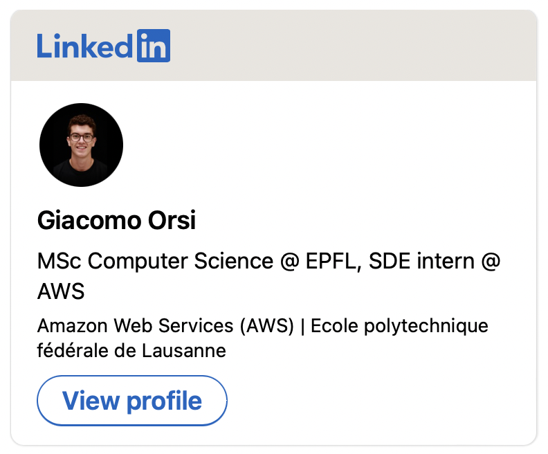

### Hi there 👋 Nice to meet you, I'm Giacomo Orsi

#### 🎓 Education
MSc Computer Science - EPFL, Swiss Federal Institute of Technology  
BSc Computer Science for Management - University of Bologna

#### 👨‍💻 Experience
Have a look at my LinkedIn profile!   

#### 📈 Projects in data science
- [**Robust Journey Planner using Spark and Hadoop**](https://github.com/giacomoorsi/Swiss-Spark-Journey-Planner): Journey planning algorithm on Swiss railway data that is able to estimate the probability of success of a trip, analyzing terabytes of historical data on demand, using Spark and Hadoop. 
- [**Deep Learning for patent novelty identification**](https://github.com/giacomoorsi/Detect-Novelty-Patent-Applications): Collaborated with the *Entrepreneurship and Technology Commercialization Lab (EPFL)* to design and develop a pipeline with a neural network that predicts whether a patent application will be approved by the USPTO
- [**Identifying news polarization**](https://github.com/epfl-ada/ada-2021-project-muesli): Analysis of 180M quotations extracted from US media sources. Built a nice data story as website available [here](https://giacomoorsi.github.io/usa-news-politicization/). 
- [**Identifying Higgs bosons on CERN data**](https://github.com/giacomoorsi/HiggsBosonChallenge): Code for [Kaggle](https://www.kaggle.com/c/higgs-boson) competition on identifying Higgs bosons using machine learning

#### 💻 Projects in computer science 
- [**Adaptation of the DXR library to work with Mixed Reality Toolkit**](https://github.com/giacomoorsi/DXR-MRTK): DXR is a library for data visualization on HoloLens which relies on Holotoolkit. I have updated the source code to make it work with the new Mixed Reality Toolkit. 
- [**MyPantry**](https://github.com/giacomoorsi/MyPantryApp): iOS app for pantry management. The app lets you store what you have in your pantry and it helps you doing your shopping list. In addition, it uses a server that matches barcode with products' information. 

#### 🧮 Projects in mathematics
- [**Progressive methods for Spline interpolation and approximation**](https://github.com/giacomoorsi/ProgressiveIterationApproximation): it contains the implementation of some methods for progressive spline interpolation and approximation in MATLAB. This work was done during my **Bachelor's thesis** in *Numerical Analysis* (you can also find the `pdf` there!). 
